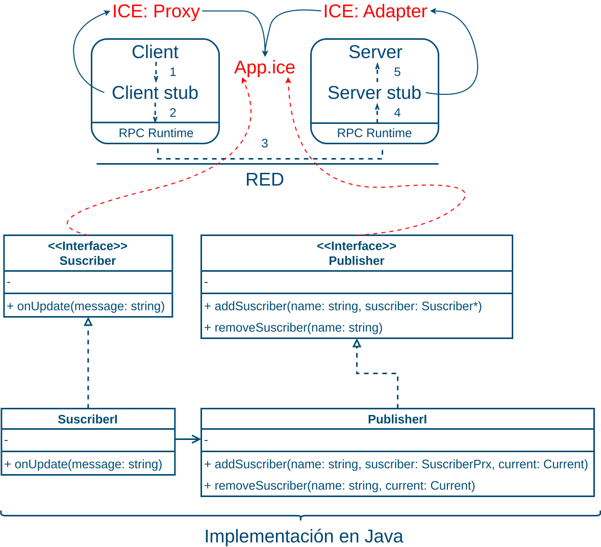

# Publisher and Suscriber in Ice with Java

### Pre-Requicitos:

Configuración con gradle: 

- build.gradle

```groovy
/*
 * This file was generated by the Gradle 'init' task.
 *
 * This is a general purpose Gradle build.
 * Learn more about Gradle by exploring our Samples at https://docs.gradle.org/8.10.2/samples
 */
plugins {
    id 'com.zeroc.gradle.ice-builder.slice' version '1.5.0' apply false
}

subprojects {
    apply plugin: 'java'
    apply plugin: 'com.zeroc.gradle.ice-builder.slice'

    slice {
        java {
            files = [file("../App.ice")] 
        }
    }

    repositories {
        mavenCentral()
    }

    dependencies {
        implementation 'com.zeroc:ice:3.7.4'
        // https://mvnrepository.com/artifact/com.google.code.gson/gson
        implementation 'com.google.code.gson:gson:2.10.1'
    }

    // Tarea para agregar las dependencias al lib donde esta el ejecutable de 
    // cada proyecto
    task copyIceJar(type: Copy) {
        from configurations.runtimeClasspath
        include 'ice-3.7.4.jar'
        include 'gson-2.10.1.jar'
        into "$buildDir/libs"
    }

    jar.dependsOn copyIceJar

    // definir en el class-path que cada librería esta en el libs 
    jar {
        manifest {
            attributes(
                "Main-Class": project.name.capitalize(),
                "Class-Path": configurations.runtimeClasspath.files.collect { "${it.name}" }.join(' ') 
        )
        }
    }
}
```

- settings.gradle

```groovy
rootProject.name = 'ProjectName'
include 'client'
include 'server'
```

### Arquitectura con Ice:



App.ice

```groovy
module Demo {

    interface Suscriber {
        void onUpdate(string s);
    }

    interface Publisher {
        void addSuscriber(string name, Suscriber* o);
        void removeSuscriber(string name);
    }
}
```

### Server:

- server/src/main/java/PublisherI.java

```java
import java.util.HashMap;
import com.zeroc.Ice.Current;
import Demo.ObserverPrx;

/**
        Definición                   Definición 
            en                          en
           Java                         Ice
            ^                            ^
            |                            |
    +-------------+             +----------------+
    | PublisherI  | ---------|> | Demo.Publisher |
    +-------------+             +----------------+
*/
import com.zeroc.Ice.Current; // definido en Ice para sus métodos 
import java.util.HashMap;
import Demo.SuscriberPrx;

public class PublisherI implements Demo.Publisher {

    private HashMap<String, SuscriberPrx> suscribers; 

    public PublisherI(){
        suscribers = new HashMap<>(); 
    }

    @Override
    public void addSuscriber(String name, SuscriberPrx suscriber, Current current){
        System.out.println("New Suscriber: ");
        suscribers.put(name, suscriber); 
    }

    @Override
    public void removeSuscriber(String name, Current current){
        suscribers.remove(name); 
        System.out.println("Suscriber has been removed ");
    }

    public void notifySuscriber(String name, String msg){
        SuscriberPrx suscriber = suscribers.get(name); 
        suscriber.onUpdate(msg);
    }
}
```

- Server: server/src/main/java/Server.java

```java
import java.io.*;

import com.zeroc.Ice.*;

public class Server {
    public static void main(String[] args) {
        try (Communicator cummunicator = Util.initialize(args, "properties.cfg")){

        ObjectAdapter adapter = cummunicator.createObjectAdapter("services"); 
        PublisherI publisher = new PublisherI();

        adapter.add(publisher, Util.stringToIdentity("Publisher")); 
        adapter.activate(); 

        BufferedReader reader = new BufferedReader(new InputStreamReader(System.in)); 
        String msg = "";
        System.out.println("Envia un mensaje con el formato: NameSuscribe::Mensaje");

        while ((msg = reader.readLine()) != null ){ 
           if (!msg.contains("::")) {
               System.out.println("Formato incorrecto. Intente de nuevo.");
               continue;
            }

            String[] command = msg.split("::");
            publisher.notifySuscribers(command[0], command[1]);
        }        

        cummunicator.waitForShutdown(); 

        reader.close();
       }
       catch (IOException e) {
            e.printStackTrace(); 
       }
```

- server/src/main/resources/properties.cfg

```groovy
services.Endpoints=default -h localhost -p 5000
```

### Cliente:

- client/src/main/java/Client.java

```java
import com.zeroc.Ice.*;
import java.io.*; 

import Demo.Suscriber;
import Demo.SuscriberPrx;
import Demo.PrinterPrx;
import Demo.PublisherPrx;

public class Client {

    public static void main(String[] args) {

        try(Communicator communicator = Util.initialize(args, "properties.cfg")) {

            BufferedReader reader = new BufferedReader(new InputStreamReader(System.in));
            System.out.println("Give me a Suscriber Name: ");

            // Name of this suscriber
            String name = reader.readLine(); 
            reader.close();        

            Suscriber suscriber = new SuscriberI(); 
            ObjectAdapter adapter = communicator.createObjectAdapter("Suscriber"); 
            ObjectPrx proxys = adapter.add(observer, Util.stringToIdentity("NotNecessaryName")); 

            adapter.activate();

            SuscriberPrx suscriberPrx = SuscriberPrx.checkedCast(proxys); 
            PublisherPrx publisher = PublisherPrx.checkedCast(communicator.propertyToProxy("publisher.proxy")); 

            if(publisher == null){
                throw new Error("Invalid Proxy >> Server Publisher is null"); 
            }

            publisher.addSuscriber(name, suscriberPrx);
            communicator.waitForShutdown(); 
        }     
        catch (IOException e) {
            e.printStackTrace(); 
        }
    }
}
```

- client/src/main/java/SuscriberI.java

```java
import com.zeroc.Ice.*;

/**
        Definición                   Definición 
            en                          en
           Java                         Ice
            ^                            ^
            |                            |
    +-------------+             +----------------+
    | SuscriberI  | ---------|> | Demo.Suscriber |
    +-------------+             +----------------+

*/
public class SuscriberI implements Demo.Suscriber {

    @Override
    public void update(String msg, Current current){
        System.out.println(msg);
    }   
}
```

- server/src/main/resources/properties.cfg

```groovy
Suscriber.Endpoints = default -p 6001 -h localhost
publisher.proxy = Publisher:default -p 5000 -h localhost
```

# 

### Compilación:

El proyecto se puede compilar con gradlew

```bash
# Run gradlew build 
$ gradle build
```

Esto generará el ejecutable en el directorio *server/build/libs/* 

```bash
$ ls server/build/libs/
gson-2.10.1.jar  ice-3.7.4.jar  server.jar
```


### Ejecución:

Desde el server:

```bash
java -jar server/build/libs/server.jar
```

Desde el cliente: 

```bash
java -jar client/build/libs/client.jar
```
